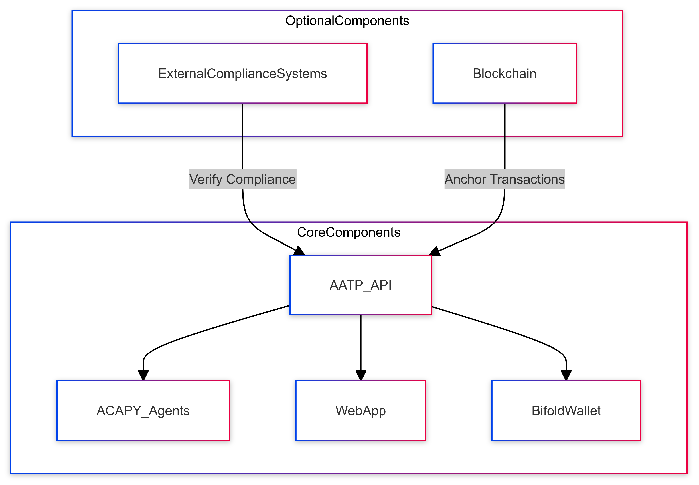
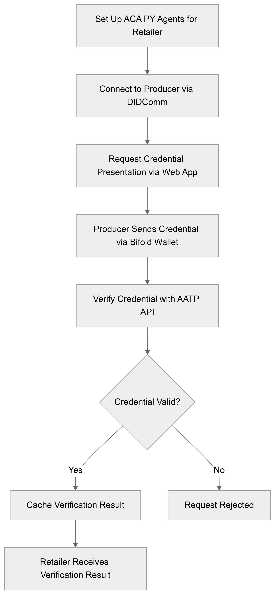
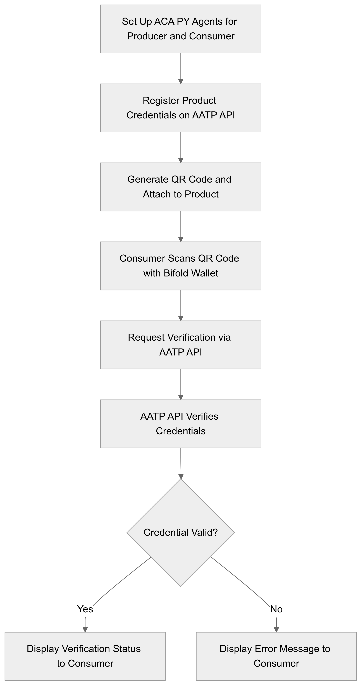
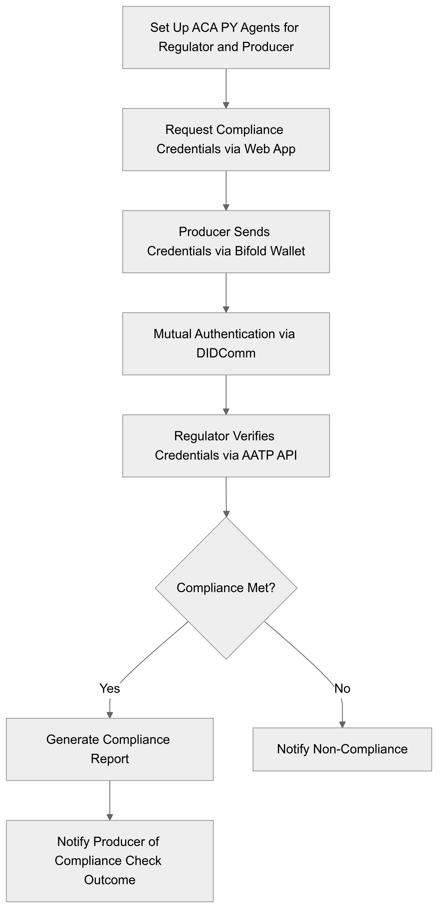
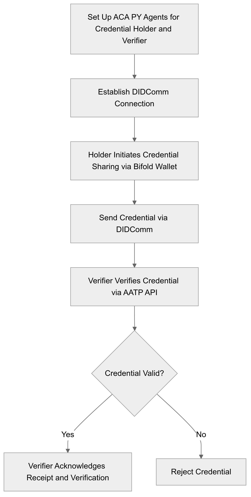

# Design

## Concept Overview
- **Objective:** Develop a decentralized, secure, and transparent system for agricultural traceability using Decentralized Identifiers (DIDs) and Verifiable Credentials (VCs).
- **Core Technology:** ACA-PY (Aries Cloud Agent Python) for identity management and DIDComm protocol for secure communication.
- **Key Components:** ACA-PY Agents, Bifold Wallet, Backend Services, AATP API, Web Application, and optional Blockchain Network.

## Key Features of DIDs and VCs
- **DIDs (Decentralized Identifiers):**
  - **Self-Sovereignty:** User-controlled without centralized authorities.
  - **Interoperability:** Built on W3C standards for compatibility across systems.
  - **Privacy:** Supports selective disclosure of data.
  - **Verifiability:** Cryptographically secure with public keys.
  - **DID Methods:** Use DID methods such as `did:sov` or `did:key` for different resolution mechanisms. Define the methods, including the resolver operations, and how DIDs are managed within the AATP system.

  **Example DID Document:**
  ```json
  {
    "@context": "https://www.w3.org/ns/did/v1",
    "id": "did:sov:123456789abcdefghi",
    "authentication": [
      {
        "id": "did:sov:123456789abcdefghi#keys-1",
        "type": "Ed25519VerificationKey2018",
        "controller": "did:sov:123456789abcdefghi",
        "publicKeyBase58": "H3C2AVvLMz...AB"
      }
    ],
    "service": [
      {
        "id": "did:sov:123456789abcdefghi#agent",
        "type": "DIDCommMessaging",
        "serviceEndpoint": "https://example.com/endpoint",
        "routingKeys": ["did:sov:123456789abcdefghi#keys-1"]
      }
    ]
  }
  ```

- **VCs (Verifiable Credentials):**
  - **Data Integrity:** Signed by the issuer’s private key to prevent tampering.
  - **Selective Disclosure:** Allows minimal data sharing.
  - **Interoperability:** W3C standard-based for wide usage.
  - **Revocation:** Supports revocation by the issuer, ensuring robust credential lifecycle management.

  **Example Verifiable Credential:**
  ```json
  {
    "@context": [
      "https://www.w3.org/2018/credentials/v1",
      "https://example.com/agriculture/credentials/v1"
    ],
    "id": "http://example.com/credentials/1872",
    "type": ["VerifiableCredential", "OrganicCertificationCredential"],
    "issuer": "did:sov:123456789abcdefghi",
    "issuanceDate": "2024-09-01T19:23:24Z",
    "credentialSubject": {
      "id": "did:sov:0987654321abcdefgh",
      "name": "Farmer John",
      "certification": "Organic Certification",
      "validUntil": "2025-09-01T00:00:00Z"
    },
    "proof": {
      "type": "Ed25519Signature2018",
      "created": "2024-09-01T19:23:24Z",
      "proofPurpose": "assertionMethod",
      "verificationMethod": "did:sov:123456789abcdefghi#keys-1",
      "jws": "eyJhbGciOi...AA"
    }
  }
  ```

## System Architecture Components
- **ACA-PY Agents:** Manage decentralized identities and credentials, supporting DID management, credential issuance, verification, and revocation.
- **Bifold Wallet:** A digital wallet solution for users to manage decentralized identities and credentials securely. The Bifold Wallet can be customized beyond the scope of this project if required, providing flexibility for future expansions.
- **AATP API:** Manages the issuance, storage, and retrieval of digital product credentials, ensuring authenticity and data integrity in a decentralized manner. The AATP API includes endpoints for credential management (issue, verify, revoke, update), DID management, and querying credentials.

  **Example AATP API Endpoints:**
  - **Credential Issuance:** `POST /api/credentials/issue`
    - **Request Body:** 
      ```json
      {
        "issuerDid": "did:sov:123456789abcdefghi",
        "subjectDid": "did:sov:0987654321abcdefgh",
        "credentialType": "OrganicCertificationCredential",
        "credentialData": {
          "name": "Farmer John",
          "certification": "Organic Certification",
          "validUntil": "2025-09-01T00:00:00Z"
        }
      }
      ```
    - **Response:**
      ```json
      {
        "credentialId": "http://example.com/credentials/1872",
        "status": "issued"
      }
      ```
  - **Credential Verification:** `POST /api/credentials/verify`
    - **Request Body:**
      ```json
      {
        "credentialId": "http://example.com/credentials/1872"
      }
      ```
    - **Response:**
      ```json
      {
        "status": "valid",
        "message": "Credential is valid and has not been revoked."
      }
      ```
- **Web Application:** A companion app that facilitates use cases by allowing users to interact with the system, view credential statuses, and manage their profiles and transactions. It serves as a complementary interface to the Bifold Wallet, enabling seamless user interaction across devices. 
  **Example Web App Functionalities:**
  - **Dashboard View:** Overview of all issued and received credentials.
  - **Credential Request Form:** Interface for producers to request credentials from certification bodies.
  - **Verification Status Check:** Tool for retailers and consumers to verify the status of product certifications.
  - **Profile Management:** Allows users to manage their DIDs and credentials.
- **Blockchain Network (Optional):** Provides an immutable ledger for anchoring DIDs and storing credential transactions, enhancing transparency and auditability.
- **External Compliance Systems:** Third-party systems or APIs interacting with AATP API.



---

## Detailed Implementation Plan for Use Cases

### Credential Issuance by Producers
**Objective:** Allow producers to request and receive verifiable credentials (VCs) for certifications.

 

#### Implementation Steps:
1. **Set Up ACA-PY Agents:** Deploy ACA-PY agents for both the credential issuer (e.g., certification body) and the producer.
2. **Create DIDs:** Generate Decentralized Identifiers (DIDs) for both issuer and producer. Register these DIDs on the appropriate network or ledger.
3. **Credential Definition and Schema:** Define a credential schema on the ledger for the type of certification, ensuring compliance with the W3C VC Data Model.
4. **Onboard Producer:** Register producer's DID with the issuer’s agent; connect using Bifold Wallet.
5. **Request Credential:** Producer uses the web application to request a credential, submitting necessary data.
6. **Issue Credential:** Issuer verifies details, issues a signed credential to the producer’s agent, and registers it with the AATP API.
7. **Store Credential:** Producer stores the credential in Bifold Wallet.
8. **Confirm Receipt:** Producer confirms receipt of the credential.
9. **Credential Revocation Process:** Include a process for revoking credentials if certifications are withdrawn or incorrectly issued, ensuring the AATP API is updated accordingly.

### Credential Verification by Retailers
**Objective:** Enable retailers to verify the authenticity of certifications before purchasing products.

 

#### Implementation Steps:
1. **Set Up ACA-PY Agents:** Deploy ACA-PY agents for the retailer.
2. **Connect to Producer:** Retailer establishes a DIDComm connection with the producer’s agent.
3. **Request Credential Presentation:** Retailer requests credential presentation via DIDComm using the web application.
4. **Present Credential:** Producer sends the credential using Bifold Wallet.
5. **Verify Credential:** Retailer’s agent uses AATP API for verification, ensuring the credential adheres to the W3C VC standards.
6. **Cache Verification Result:** Retailer’s agent caches the verification result to optimize performance for repeated checks.
7. **Receive Verification Result:** Retailer receives the verification result confirming authenticity.

### Product Traceability for Consumers
**Objective:** Allow consumers to verify product sustainability credentials via QR codes.

 

#### Implementation Steps:
1. **Set Up ACA-PY Agents:** Deploy ACA-PY agents for both producer and consumer.
2. **Register Product Credentials:** Producer registers digital product passport credentials on AATP API.
3. **Generate QR Code:** Generate a QR code with product DID and attach it to packaging. Ensure the DID is not easily guessable to prevent unauthorized access.
4. **Consumer Scans QR Code:** Consumer scans the QR code using Bifold Wallet.
5. **Request Verification:** Consumer’s wallet requests verification from AATP API.
6. **Verify Product Credentials:** AATP API verifies credentials and returns the result.
7. **Display Verification Status:** Consumer's wallet displays the verification result.

### Regulatory Compliance Checks
**Objective:** Enable regulatory bodies to conduct compliance checks.

 

#### Implementation Steps:
1. **Set Up ACA-PY Agents:** Deploy ACA-PY agents for both the regulatory body and producers.
2. **Request Compliance Credentials:** Regulator requests compliance credentials via ACA-PY agent using the web application.
3. **Present Compliance Credentials:** Producer sends credentials using Bifold Wallet.
4. **Mutual Authentication:** Ensure that the regulatory body authenticates itself to the producer’s agent using mutual DIDComm authentication.
5. **Verify Compliance:** Regulator’s agent verifies credentials with AATP API, ensuring they meet the required standards.
6. **Generate Compliance Report:** Regulator generates a compliance report based on verification.
7. **Notify Producer:** Producer is notified of the compliance check outcome.

### Decentralized Credential Sharing
**Objective:** Enable secure, direct sharing of credentials between stakeholders.

 

#### Implementation Steps:
1. **Set Up ACA-PY Agents:** Deploy ACA-PY agents for both the credential holder (e.g., farmer) and the verifier (e.g., retailer).
2. **Establish DIDComm Connection:** Secure DIDComm connection established between stakeholders using DIDComm messaging patterns (e.g., one-to-one, broadcast).
3. **Initiate Credential Sharing:** Credential holder uses Bifold Wallet to share the credential.
4. **Send Credential:** Credential sent via DIDComm to the verifier’s agent.
5. **Credential Verification:** Verifier’s agent verifies the credential with AATP API.
6. **Acknowledge Receipt:** Verifier confirms receipt and verification of the credential.

### Emergency Recall Notifications
**Objective:** Manage product recalls and revoke related credentials.

 

#### Implementation Steps:
1. **Set Up ACA-PY Agents:** Deploy ACA-PY agents for the issuing authority and stakeholders.
2. **Initiate Recall:** Issuing authority initiates recall using the web application and updates credential status.
3. **Update Credential Status:** Credentials marked as revoked in AATP API.
4. **Notify Stakeholders:** All stakeholders are notified via DIDComm. Define clear messaging protocols for efficient recall communication.
5. **Acknowledge Recall:** Stakeholders confirm receipt and update their systems.
6. **Ensure Revocation:** AATP API confirms revocation status, ensuring all credentials are invalidated.
7. **Monitor Compliance:** Issuing authority monitors compliance with recall procedures, using DIDComm for secure and efficient updates.

## Security, Performance, and Interoperability Considerations
- **Security:** Ensure all communication via DIDComm is end-to-end encrypted. Implement mutual authentication to prevent unauthorized access. Specify encryption standards such as AES-256 for data encryption and SHA-256 for hashing.
- **Performance Optimization:** Use caching strategies for credential verification and DID document resolution to improve performance. Employ load balancing techniques to handle increased data loads.
- **Interoperability:** Ensure the system is compatible with various DID methods and can interoperate with other identity systems not using ACA-PY or DIDComm. Define an interoperability framework outlining integration with other decentralized identity solutions and traditional systems.

## Governance and Compliance Framework
- **Governance Policies:** Define governance policies for credential lifecycle management, including roles and responsibilities of various stakeholders, procedures for disputes, and compliance with relevant regulations.
- **Audit and Compliance Mechanisms:** Include mechanisms for auditing credential issuance and verification processes to ensure transparency and accountability.

## Implementation plan:
### **aatp-core-services**
   - **Objective:** Consolidate all core backend services and components required for the AATP system, including ACA-PY agents, API services, DID management, and optional blockchain integration.
   - **Components Included:**
     - ACA-PY agents for decentralized identity and credential management.
     - Backend APIs for credential issuance, verification, revocation, and DID operations.
     - DID management tools, compliant with W3C DID specifications (creation, resolution, updates, deactivation).
     - Optional blockchain integration to provide an immutable ledger for DID anchoring and credential transactions.

### **aatp-mobile-app**
   - **Objective:** Develop a customized mobile application based on the Bifold Wallet, tailored to AATP-specific use cases for managing credentials, performing selective disclosure, and scanning QR codes.
   - **Components Included:**
     - Customized Bifold Wallet for mobile users.
     - QR code scanning functionality for verifying product credentials.
     - User-friendly mobile interface for managing decentralized identities and credentials.

### **aatp-web-app**
   - **Objective:** Build a web-based application to enable stakeholders to interact with the AATP system from a desktop interface, manage credentials, perform verification checks, and view dashboards.
   - **Components Included:**
     - User interface for credential management and verification.
     - Dashboard for monitoring issued and received credentials.
     - Integration with the AATP core services for backend operations.

### **aatp-compliance-testing-and-docs**
   - **Objective:** Merge compliance tools, governance scripts, integration testing, and documentation into one repository to ensure the system meets regulatory standards, functions reliably, and provides clear guidance for deployment and use.
   - **Components Included:**
     - Scripts and tools for governance, compliance checks, and audit processes.
     - Integration testing suite to validate the functionality and interoperability of all AATP components.
     - Comprehensive documentation, including setup guides, API documentation, and user manuals.
     - Demo scripts and sample data to showcase various use cases (credential issuance, verification, traceability, and compliance workflows).
